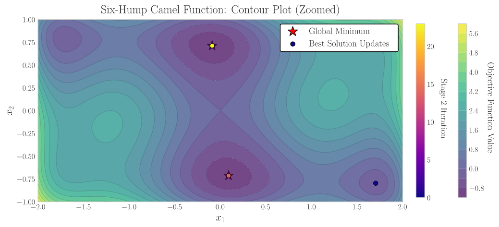

import Latex from "../../../components/Latex.astro";

:::note[A Note on Convergence]

`GlobalSearch` does not guarantee convergence to the global optimum. However, it is designed to efficiently explore the search space and increase the likelihood of finding high-quality solutions.

:::

`globalsearch-rs` is a Rust implementation of the _OQNLP_ (OptQuest/NLP) algorithm, a global
optimization algorithm that combines scatter search with local nonlinear programming (NLP) solvers.

Briefly, the algorithm operates in two distinct stages: 
 - **Stage 1** (Scatter Search) generates a diverse reference set of candidate points through strategic sampling and combination.
 - **Stage 2** (Iterative Improvement) refines promising candidates using local optimization with adaptive filtering mechanisms.

## How the Algorithm Works

The _OQNLP_ algorithm is structured as a two-stage multistart optimization approach:

### Stage 1: Scatter Search (Exploration)

Stage 1 creates a diverse reference set of `population_size` candidate points through six phases:

- **Initialization**: The algorithm begins by adding three anchor points to the reference set: the lower bound corner, upper bound corner, and centroid (midpoint between bounds). These strategic locations ensure coverage of the search space boundaries.

- **Diversification**: Using stratified random sampling, `population_size` candidate points are generated uniformly within the variable bounds. The algorithm iteratively selects candidates that maximize the minimum distance to existing reference set points, ensuring spatial diversity.

- **Evaluation**: All points in the reference set are evaluated using the objective function and sorted in ascending order by their objective values.

- **Intensification**: The top `k` best points (where `k = max(2, min(⌊sqrt(population_size)⌋, population_size))`) are selected for combination. All pairs of these elite points generate trial points through:
  - **Linear combinations**: Four interpolation/extrapolation points using weights (0.25, 0.5, 0.75, 1.25)
  - **Random perturbations**: Two points near the pair's midpoint with small random deviations (±10% of variable ranges)

**Reference Set Update**: Trial points undergo diversity and quality filtering:
- Points too close to the top 5 reference points (distance < 10% of average distance) are rejected
- Only trials better than the worst reference point are evaluated
- The reference set is updated by selecting the best points from the merged pool of original and accepted trial points

**Output**: The algorithm returns the sorted reference set with pre-computed objective values and the best solution found.

### Stage 2: Iterative Improvement (Local Optimization)

Stage 2 processes the reference set through `iterations` iterations, applying two adaptive filters before local optimization:

**Merit Filter**: Only trial points with objective values below or equal to the current merit threshold are accepted. The threshold is initialized to the best objective from Stage 1 and adaptively relaxed when progress stagnates.

**Distance Filter**: Trial points are rejected if they are too close (within `distance_factor`) to any previously accepted solution, preventing redundant local searches and maintaining solution diversity.

**Processing Logic**:
- When both filters pass, the trial point undergoes local optimization using an NLP solver.
- When the filters reject a point, an unchanged cycle counter increments
- After `wait_cycle` consecutive rejections, the merit threshold is relaxed: `T_merit ← T_merit + threshold_factor (1 + |T_merit|)`

**Solution Set Management**: Local optimization results are processed with strict criteria:
- **New global best**: If a solution is better than the current best (by relative tolerance 1e-6 and absolute tolerance 1e-8), the entire solution set is replaced
- **Similar objective**: Solutions within tolerance of the best are added as distinct minima if sufficiently far from existing solutions
- **Worse solutions**: Rejected, but added to the distance filter to maintain search space coverage

**Parallel Processing**: When the `rayon` feature is enabled and `batch_size > 1`, Stage 2 iterations are processed in batches with parallel filter evaluation and local search execution, while maintaining sequential consistency for state updates.

### Construction of Solution Set

After running for the selected amount of iterations, optimal solutions are collected from the local
refinements and combined into a final solution set. This set represents the best-found solutions
across all multistart attempts, providing a diverse range of high-quality candidates for further
analysis or deployment.

Equal solutions are defined as solutions that have the same objective function value with a relative
tolerance of `1e-6` and an absolute tolerance of `1e-8`.

## Algorithm Pseudocode

The following pseudocode summarizes the two main stages of the _OQNLP_ algorithm.

### Stage 1: Scatter Search

export const stage1Algo = String.raw`
\begin{array}{l}
\textbf{Algorithm 1:} \text{ Scatter Search (Stage 1)} \\
\hline
\textbf{Input:} \text{ bounds } [l, u], N \text{ (population\_size)}, f(x) \\
\textbf{Output:} R \text{ (reference set)}, x_{\text{best}} \\
\hline
\text{Initialize } R \leftarrow \{l, u, (l+u)/2\} \\
\text{Generate } N \text{ candidates uniformly in bounds} \\
\textbf{while } |R| < N \textbf{ do} \\
\quad c^* \leftarrow \arg\max_{c} \min_{r \in R} \|c - r\|^2 \quad \text{(maximize diversity)} \\
\quad R \leftarrow R \cup \{c^*\} \\
\textbf{end while} \\
\text{Evaluate all } r \in R: f_r \leftarrow f(r) \\
\text{Sort } R \text{ by } f: f(r_1) \leq f(r_2) \leq \cdots \leq f(r_N) \\
k \leftarrow \max(2, \min(\lfloor\sqrt{N}\rfloor, N)) \\
\textbf{for } i = 1 \text{ to } k-1 \textbf{ do} \\
\quad \textbf{for } j = i+1 \text{ to } k \textbf{ do} \\
\quad \quad \text{Generate 6 trials from } (r_i, r_j): \\
\quad \quad \quad \text{4 linear: } t = \alpha \cdot r_i + (1-\alpha) \cdot r_j, \; \alpha \in \{0.25, 0.5, 0.75, 1.25\} \\
\quad \quad \quad \text{2 random: perturbations near midpoint } (\pm 10\% \text{ range}) \\
\quad \textbf{end for} \\
\textbf{end for} \\
\text{Filter trials: accept if distance} > 0.1 \cdot \text{avg\_distance from top 5 and } f(t) < f(r_N) \\
R \leftarrow \text{top } N \text{ from } \{R \cup \text{accepted trials}\} \\
\textbf{return } (R, r_1)
\end{array}
`;

<Latex formula={stage1Algo} />

### Stage 2: Iterative Improvement

export const stage2Algo = String.raw`
\begin{array}{l}
\textbf{Algorithm 2:} \text{ Iterative Improvement (Stage 2)} \\
\hline
\textbf{Input:} R \text{ (from Stage 1)}, M \text{ (iterations)}, W \text{ (wait\_cycle)}, \tau \text{ (threshold\_factor)}, \\
\quad \quad \quad \delta \text{ (distance\_factor)} \\
\textbf{Output:} S \text{ (solution set)}, x_{\text{best}} \\
\hline
S \leftarrow \emptyset, \; D \leftarrow \emptyset, \; T_{\text{merit}} \leftarrow f(r_1), \; c_{\text{unchanged}} \leftarrow 0 \\
\text{Shuffle } R \\
\textbf{for } i = 0 \text{ to } \min(M, |R|) - 1 \textbf{ do} \\
\quad x_{\text{trial}} \leftarrow R[i] \\
\quad \text{passes\_merit} \leftarrow (f(x_{\text{trial}}) \leq T_{\text{merit}}) \\
\quad \text{passes\_distance} \leftarrow (\|x_{\text{trial}} - d\|^2 \geq \delta^2 \; \forall d \in D) \\
\quad \textbf{if } \text{passes\_merit} \land \text{passes\_distance} \textbf{ then} \\
\quad \quad T_{\text{merit}} \leftarrow f(x_{\text{trial}}) \\
\quad \quad (x_{\text{local}}, f_{\text{local}}) \leftarrow \text{local\_solver}(x_{\text{trial}}) \\
\quad \quad \text{ProcessSolution}(x_{\text{local}}, f_{\text{local}}, S, D, \delta) \\
\quad \quad c_{\text{unchanged}} \leftarrow 0 \\
\quad \textbf{else} \\
\quad \quad c_{\text{unchanged}} \leftarrow c_{\text{unchanged}} + 1 \\
\quad \quad \textbf{if } c_{\text{unchanged}} \geq W \textbf{ then} \\
\quad \quad \quad T_{\text{merit}} \leftarrow T_{\text{merit}} + \tau \cdot (1 + |T_{\text{merit}}|) \\
\quad \quad \quad c_{\text{unchanged}} \leftarrow 0 \\
\quad \quad \textbf{end if} \\
\quad \textbf{end if} \\
\textbf{end for} \\
\textbf{return } (S, \text{best from } S)
\end{array}
`;

<Latex formula={stage2Algo} />

Where the subroutine `ProcessSolution` manages the solution set by adding new solutions based on their objective values and distances from existing solutions. It ensures that only distinct and high-quality solutions are retained in the final set.
It can be summarized as follows:

export const processSolutionAlgo = String.raw`
\begin{array}{l}
\textbf{Subroutine:} \text{ ProcessSolution}(x_{\text{local}}, f_{\text{local}}, S, D, \delta) \\
\hline
D \leftarrow D \cup \{x_{\text{local}}\} \\
\text{tol} \leftarrow \max(10^{-8}, 10^{-6} \cdot \max(|f_{\text{local}}|, |f_{\text{best}}|)) \\
\textbf{if } f_{\text{local}} < f_{\text{best}} - \text{tol} \textbf{ then} \\
\quad S \leftarrow \{(x_{\text{local}}, f_{\text{local}})\} \\
\quad T_{\text{merit}} \leftarrow f_{\text{local}} \quad \text{(update merit threshold)} \\
\textbf{else if } |f_{\text{local}} - f_{\text{best}}| \leq \text{tol} \land \text{not duplicate} \textbf{ then} \\
\quad S \leftarrow S \cup \{(x_{\text{local}}, f_{\text{local}})\} \\
\textbf{end if}
\end{array}
`;

<Latex formula={processSolutionAlgo} />

## Graphical Example

In the following example, we optimize the well-known Six-Hump Camel function. The function is continuous, differentiable and non-convex. It is defined as follows [^1]:

export const f =
  "f(x_1, x_2) = \\left( 4 - 2.1 x_1^2 + \\frac{x_1^4}{3} \\right) x_1^2 + x_1 x_2 + (-4 + 4 x_2^2) x_2^2";

<Latex formula={f} />

The function has two global minima at approximately <Latex formula="\mathbf{x}^* = (0.0898, -0.7126)" inline /> and <Latex formula="\mathbf{x}^* = (-0.0898, 0.7126)" inline /> with a function value of <Latex formula="f(\mathbf{x}^*) \approx -1.0316" inline />.

The function is defined in the domain <Latex formula="x_1 \in [-3, 3]" inline /> and <Latex formula="x_2 \in [-2, 2]" inline />.

In this case, we run the algorithm with a population size of 100 and 65 stage two iterations. The `distance_factor` is set to 0.75, the `wait_cycle` to 10, the `threshold_factor` to 0.5 and the `seed` to 0. The local solver used is `COBYLA` with the default configuration.

### Creating the Reference Set

The reference set is created using scatter search techniques. The following plot shows a countour plot of the function with the initial population of 100 points (green crosses). The red star indicates the best point in the initial population, in which the local solver is started.

### Stage Two Iterations

The algorithm then enters the stage two iterations, where it performs local optimization on the selected reference set points that have been identified as promising (i.e. those within the merit and distance thresholds). The following plots show the contour plot and surface of the function colored by the stage two iteration number.

### Convergence Analysis

The following plot shows the convergence of the best objective function value found during the optimization process. The X-axis represents the number of function evaluations, while the y-axis represents the best objective function value found so far.

The plot shows that the algorithm first finds a local minima and then improves it over time. The algorithm successfully finds both global minima of the Six-Hump Camel function.

The algorithm was run on a Windows 10 machine using a Ryzen 5 5500 processor with 16 GB of RAM @ 3200 MHz, using rust 1.91.0 with the `release` profile.
The code to reproduce this example can be found in the [plots](https://github.com/GermanHeim/globalsearch-rs-website/tree/main/plots) folder of the GitHub repository.

## References

[^1]:
    Molga, M., & Smutnicki, C. Test functions for optimization needs (April 3, 2005), pp. 27-28. Retrieved January 2025, from https://robertmarks.org/Classes/ENGR5358/Papers/functions.pdf
