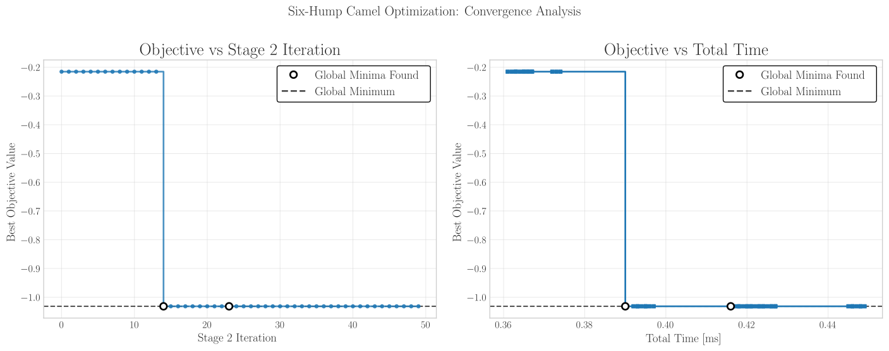

import Latex from "../../../components/Latex.astro";

`globalsearch-rs` is a Rust implementation of the _OQNLP_ (OptQuest/NLP) algorithm, a global
optimization algorithm that combines scatter search with local nonlinear programming (NLP) solvers.

The algorithm follows a multistart strategy, where an initial set of points (also known as reference
set) is generated using scatter search techniques. Promising candidates are selected and refined
using local solvers, allowing for efficient navigation of the search space.

## How the Algorithm Works

The _OQNLP_ algorithm operates in the following steps:

### Scatter Search (Exploration)

The algorithm begins by sampling a diverse population of candidate points within the variable
bounds. This stage explores the full search space broadly and heuristically selects promising
starting points.

### Local Optimization (Exploitation)

Each selected candidate is refined using a local NLP solver—provided by the [`cobyla`](https://github.com/relf/cobyla) and [`argmin`](https://github.com/argmin-rs/argmin) crate—with optional gradient or Hessian information.
These local optimizers aim to drive solutions towards local minima of your objective function.

### Multistart Coordination

The algorithm alternates between scatter search steps and localized refinements through distance and
merit filters.

Merit filtering applies a threshold-based cutoff, where only points whose objective function (i.e.
"merit") is within a certain relative range of the best-known solution are eligible for further
processing. The better candidate's merit establishes a baseline.

On the other hand, distance filtering enforces spatial diversity among selected candidates. It uses
a parameter `distance_factor` along with the population’s reference set to measure how far each new
candidate is from existing ones.

Merit filtering ensures computational effort is focused on reasonably strong candidates, improving
efficiency, while distance filtering avoids redundant local searches from near-identical
points—reducing wasted computation and increasing the probability of hitting the global optimum.

This multistart design reduces the impact of poor initialization and helps uncover global optima.

### Construction of Solution Set

After running for the selected amount of iterations, optimal solutions are collected from the local
refinements and combined into a final solution set. This set represents the best-found solutions
across all multistart attempts, providing a diverse range of high-quality candidates for further
analysis or deployment.

Equal solutions are defined as solutions that have the same objective function value with a relative
tolerance of `1e-6` and an absolute tolerance of `1e-8`.

## Graphical Example

In the following example, we optimize the well-known Six-Hump Camel function. The function is continuous, differentiable and non-convex. It is defined as follows [^1]:

export const f =
  "f(x_1, x_2) = \\left( 4 - 2.1 x_1^2 + \\frac{x_1^4}{3} \\right) x_1^2 + x_1 x_2 + (-4 + 4 x_2^2) x_2^2";

<Latex formula={f} />

The function has two global minima at approximately <Latex formula="\mathbf{x}^* = (0.0898, -0.7126)" inline /> and <Latex formula="\mathbf{x}^* = (-0.0898, 0.7126)" inline /> with a function value of <Latex formula="f(\mathbf{x}^*) \approx -1.0316" inline />.

The function is defined in the domain <Latex formula="x_1 \in [-3, 3]" inline /> and <Latex formula="x_2 \in [-2, 2]" inline />.

In this case, we run the algorithm with a population size of 100 and 65 stage two iterations. The `distance_factor` is set to 0.75, the `wait_cycle` to 10, the `threshold_factor` to 0.5 and the `seed` to 0. The local solver used is `COBYLA` with the default configuration.

### Creating the Reference Set

The reference set is created using scatter search techniques. The following plot shows a countour plot of the function with the initial population of 100 points (green crosses). The red star indicates the best point in the initial population, in which the local solver is started.

### Stage Two Iterations

The algorithm then enters the stage two iterations, where it performs local optimization on the selected reference set points that have been identified as promising (i.e. those within the merit and distance thresholds). The following plots show the contour plot and surface of the function colored by the stage two iteration number.

### Convergence Analysis

The following plot shows the convergence of the best objective function value found during the optimization process. The X-axis represents the number of function evaluations, while the y-axis represents the best objective function value found so far.

The Y-axis uses a symmetric logarithmic scale to better visualize the convergence behavior. The plot shows that the algorithm quickly finds a good solution and then improves it over time. The algorithm successfully finds both global minima of the Six-Hump Camel function.

The algorithm was run on a Windows 10 machine using a Ryzen 5 5500 processor with 16 GB of RAM @ 3200 MHz, using rust 1.87.0 with the `release` profile.

## References

[^1]:
    Molga, M., & Smutnicki, C. Test functions for optimization needs (April 3, 2005), pp. 27-28. Retrieved January 2025, from https://robertmarks.org/Classes/ENGR5358/Papers/functions.pdf
